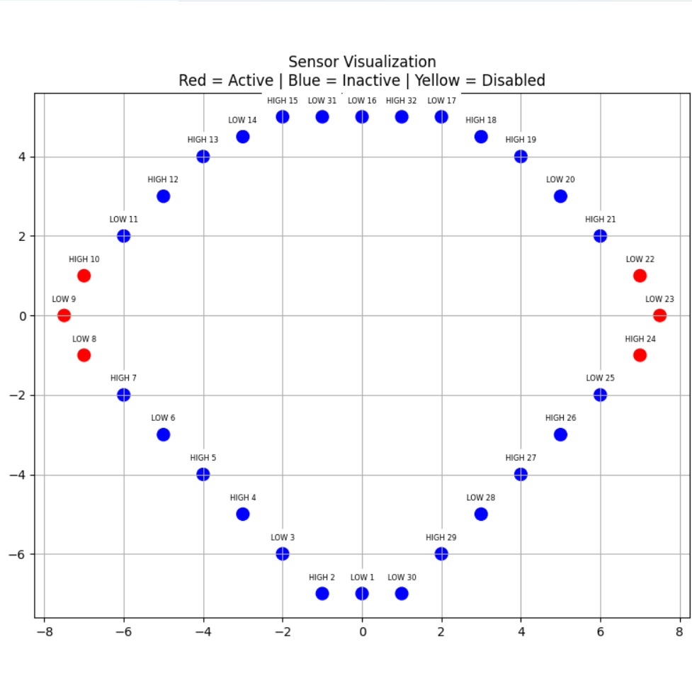
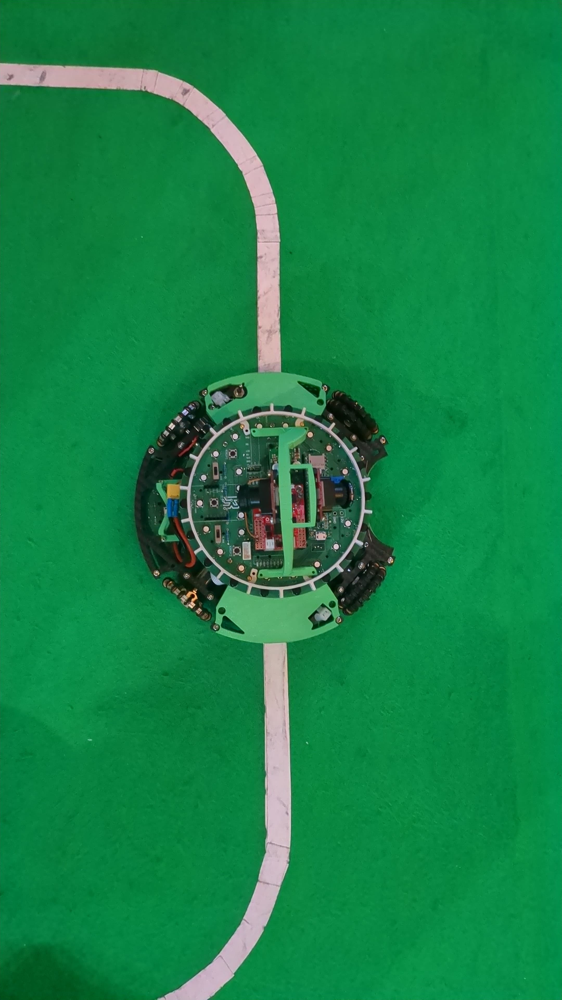

# phototransistor-visualiser-app

_A real-time sensor monitoring tool for phototransistors_

<div style="display: flex; gap: 10px;">
  
  
</div>

---

## 📖 Table of Contents

- [Abstract](#Abstract)
- [Features](#Features)
- [How to Use](#How-to-use)
- [Customization](#Customization)
- [Installation](#installation)
- [Credits](#Credits)

---

## Abstract

For my robotics team Roboticus, we needed a better way to monitor **32 phototransistor sensors** while detecting a white line. Simply reading raw serial values was inefficient so we built this real-time visualizer to:  
✔ Clearly display which sensors are triggered  
✔ Optimize debugging with instant visual feedback

---

## Features

- Live 2D representation of sensor positions
- Color-coded coordinates representing activation
- COM port selection when reading data

---

## How to use

1. Upload the arduino code to your microprocessor
2. Calibrate the coordinates for the visual in case of any specific shape of a pcb
3. Run the python code while the microprocessor is powered
4. Select the correct COM port
5. Enjoy the visual feedback

---

## Customization

Give coordinates for each sensor to match a specific shape (i.e. of a PCB).  
Useful if you need to detect only the right side gets activated or only the left.

---

## Installation

1. **Clone the repository**:

   ```bash
   git clone https://github.com/sSpectrals/phototransistor-visualizer.git
   ```

2. **Install dependencies:**:

   ```bash
   pip install -r docs/requirements.txt
   ```

---

## Credits

Developed by Edgar Mamikonian as part of Roboticus Robotics Team
